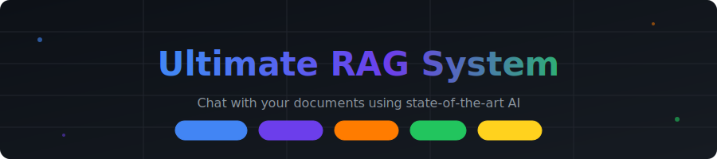
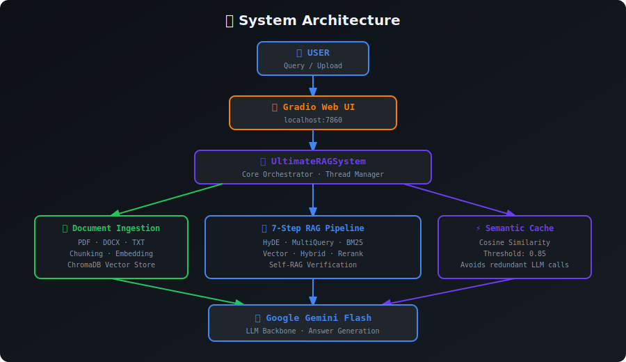
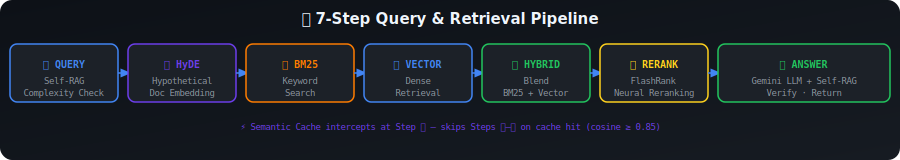
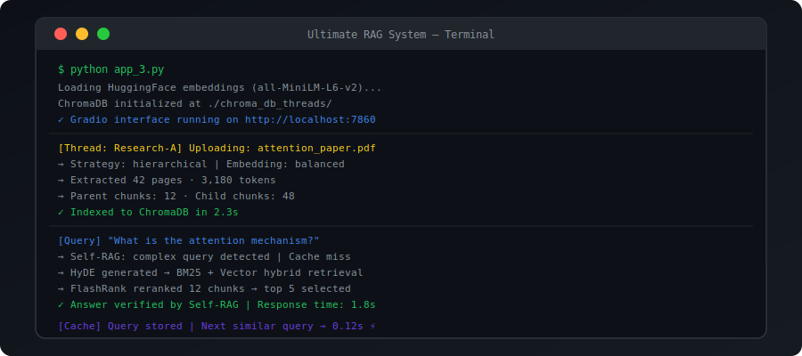
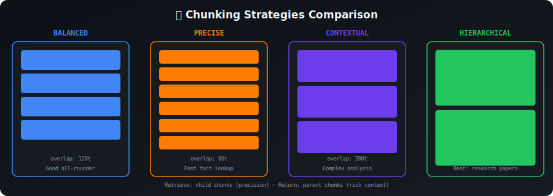
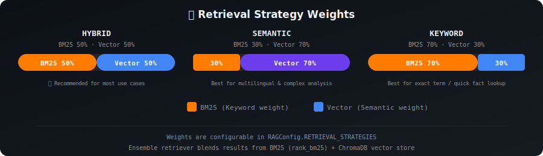
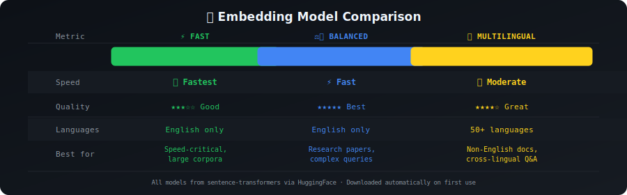
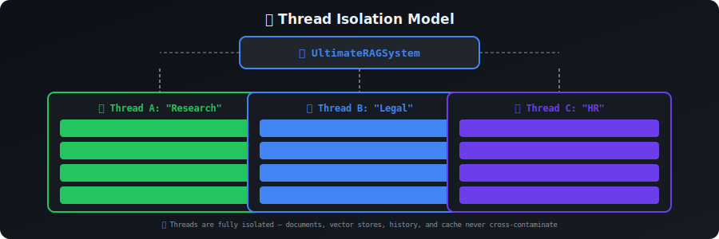

<div align="center">



[](https://www.python.org/)
[](https://langchain.com/)
[](https://ai.google.dev/)
[](https://gradio.app/)
[](https://www.trychroma.com/)
[](https://huggingface.co/)
[](LICENSE)

*Chat with your documents using state-of-the-art AI — multi-thread support, Self-RAG, hybrid retrieval, and semantic caching.*

[Features](#-features) • [How It Works](#-how-it-works) • [Demo](#-demo) • [Installation](#-installation) • [Usage](#-usage) • [Architecture](#-architecture) • [Configuration](#-configuration)

</div>

---

## 📌 Overview

**Ultimate RAG System** is a fully-featured, multi-threaded document Q&A application powered by **Google Gemini**, **LangChain**, and **ChromaDB**. Upload PDFs, Word documents, or text files and have intelligent, context-aware conversations about their contents — all through a clean **Gradio** web interface.

What sets it apart is a deeply engineered **7-step retrieval pipeline**: stacking BM25 keyword search, dense vector search, FlashRank neural reranking, Self-RAG answer verification, and semantic query caching — all cooperating to deliver fast, accurate, grounded responses.

---

## 🌐 System Architecture



---

## ✨ Features

| Feature | Description |
|---------|-------------|
| 🗂️ **Multi-Thread Management** | Isolated threads — each with its own documents, vector store, and chat history |
| 🔀 **Hybrid Retrieval** | BM25 + Dense vector search with fully configurable weight blending |
| 🏆 **Neural Reranking** | FlashRank (ms-marco-MiniLM-L-12-v2) reorders results for precision |
| 🧠 **Self-RAG** | LLM self-evaluates query complexity and verifies answer quality |
| ⚡ **Semantic Cache** | Cosine-similarity cache avoids redundant LLM calls (threshold 0.85) |
| 🪵 **Hierarchical Chunking** | Parent/child chunk architecture for precision + rich context |
| 📄 **Multi-Format Ingestion** | PDF, DOCX, DOC, TXT all fully supported |
| 📊 **Query Analytics** | Per-thread logs with response times, chunk counts, cache hit rates |
| 🔁 **Auto-Retry** | Exponential backoff handles API quota errors gracefully |

---

## 🔄 How It Works

### Phase 1 — Document Ingestion

```
RAW FILE  (PDF / DOCX / TXT)
    │
    ▼
DOCUMENT LOADER  ─────  extracts text + page metadata
    │
    ▼
DOCUMENT ANALYZER
   ├─ Section detection:  Abstract · Intro · Methods · Results · Conclusion
   ├─ Key term extraction:  word frequency analysis
   └─ Visual flag:  Figure · Table · Algorithm
    │
    ├──── Flat Chunking ──────────────────── Hierarchical Chunking
    │     (precise / balanced / contextual)   (parent 2000t → child 500t)
    │
    ▼
HuggingFace Embeddings  →  ChromaDB Vector Store
```

### Phase 2 — Query & Retrieval Pipeline



---

## 🎬 Demo



---

## 🪵 Chunking Strategies



---

## 🔎 Retrieval Strategy Weights



---

## 🤖 Embedding Models



---

## 🧵 Thread Isolation



---

## 🏗️ Architecture

### Class Map

```
┌──────────────────────────────────────────────────────────────────────────┐
│                          CLASS RELATIONSHIPS                             │
│                                                                          │
│  RAGConfig ──────────────────────────────────────────────────────────┐  │
│  (strategy params)                                                   │  │
│                                                                      ▼  │
│  SemanticCache ──────────────────────► UltimateRAGSystem ◄── ThreadData │
│  (cosine-sim cache)                   (orchestrator)       (per-thread) │
│                                              │                          │
│                          ┌───────────────────┼──────────────┐           │
│                          ▼                   ▼              ▼           │
│                   AdvancedRetriever       SelfRAG    DocumentAnalyzer   │
│                   ├─ create_hyde()        ├─ analyze_query()            │
│                   ├─ create_multi_q()     └─ verify_answer()            │
│                   ├─ create_ensemble()                                  │
│                   └─ create_compress()                                  │
└──────────────────────────────────────────────────────────────────────────┘
```

### File Structure

```
ultimate-rag-system/
│
├── 📄 app.py                     ← Entire application
│   ├── 🔧 RAGConfig                ← Strategy parameters & constants
│   ├── ⚡ SemanticCache             ← Cosine-similarity query cache
│   ├── 📦 ThreadData               ← Per-thread isolated state
│   ├── 🔬 DocumentAnalyzer         ← Metadata & structure extraction
│   ├── 🔍 AdvancedRetriever        ← HyDE, MultiQuery, Ensemble, Rerank
│   ├── 🧠 SelfRAG                  ← Query analysis & answer verification
│   └── 🎯 UltimateRAGSystem        ← Core orchestrator + Gradio UI
│
├── 🗄️  chroma_db_threads/           ← Auto-created at runtime
│   └── {thread-uuid}/              ← Isolated vector store per thread
│
├── 🔐 .env                         ← API keys (never commit this)
├── 📋 requirements.txt
└── 📖 README.md
```

---

## 🛠️ Installation

**Prerequisites:** Python 3.9+ · [Google Gemini API Key](https://ai.google.dev/)

```bash
# 1 — Clone
git clone https://github.com/ZeyadArafa/ultimate-rag-system.git
cd ultimate-rag-system

# 2 — Virtual environment
python -m venv venv
source venv/bin/activate          # Windows: venv\Scripts\activate

# 3 — Dependencies
pip install -r requirements.txt

# 4 — API key
echo "GOOGLE_API_KEY=your_key_here" > .env

# 5 — Run
python app.py
# Open → http://localhost:7860
```

---

## 📦 Requirements

```txt
gradio
langchain
langchain-google-genai
langchain-huggingface
langchain-community
langchain-text-splitters
langchain-core
langchain-classic
chromadb
flashrank
rank-bm25
sentence-transformers
pypdf
unstructured[docx]
python-dotenv
numpy
```

---

## 🚀 Usage Guide

**① Create a Thread** — Name it and isolate your context. Each thread has its own documents and memory.

**② Upload a Document** — Pick chunking strategy and embedding model, then drop in your PDF/DOCX/TXT.

**③ Configure Retrieval** — Choose retrieval strategy (`hybrid` recommended), toggle Self-RAG and Semantic Cache.

**④ Chat** — Ask anything in natural language. History is preserved and resolved across turns.

### 💡 Strategy Decision Guide

| Goal | Chunking | Retrieval | Self-RAG | Cache |
|------|----------|-----------|----------|-------|
| 📰 Research papers | `hierarchical` | `hybrid` | ✅ ON | ✅ ON |
| 🔎 Quick fact lookup | `precise` | `keyword` | ❌ OFF | ✅ ON |
| ⚡ Maximum speed | `precise` | `hybrid` | ❌ OFF | ✅ ON |
| 🌍 Multilingual docs | `balanced` | `semantic` | ✅ ON | ❌ OFF |
| 📊 Complex analysis | `contextual` | `semantic` | ✅ ON | ❌ OFF |
| 📚 Multi-doc topics | `balanced` | `hybrid` | ✅ ON | ✅ ON |

---

## ⚙️ Configuration

```python
class RAGConfig:
    CHUNK_STRATEGIES = {
        "balanced":     {"size": 700,  "overlap": 120},
        "precise":      {"size": 400,  "overlap": 80},
        "contextual":   {"size": 1200, "overlap": 200},
        "hierarchical": {"parent_size": 2000, "child_size": 500, "overlap": 100}
    }
    RETRIEVAL_STRATEGIES = {
        "hybrid":   {"bm25_weight": 0.5, "vector_weight": 0.5},
        "semantic": {"bm25_weight": 0.3, "vector_weight": 0.7},
        "keyword":  {"bm25_weight": 0.7, "vector_weight": 0.3}
    }
    EMBEDDING_MODELS = {
        "fast":         "all-MiniLM-L6-v2",
        "balanced":     "sentence-transformers/all-mpnet-base-v2",
        "multilingual": "sentence-transformers/paraphrase-multilingual-MiniLM-L12-v2"
    }
    API_RETRY_DELAY = 2
    MAX_API_RETRIES = 3
```

---

## 🔧 Troubleshooting

| Symptom | Solution |
|---------|----------|
| 🐌 Slow responses | Use `fast` embedding · disable Self-RAG |
| 🎯 Irrelevant answers | Switch to `semantic` retrieval |
| 🔍 Missing detail | Use `contextual` chunking |
| ⚠️ API quota errors | System auto-retries with exponential backoff |
| 🧵 Thread confusion | Check active thread before uploading |
| 🔑 API key not found | Ensure `.env` exists with `GOOGLE_API_KEY` set |
| 💾 ChromaDB error | Check write permissions on `./chroma_db_*` |
| 📄 Unsupported format | Only PDF, DOCX, DOC, TXT are supported |

---

## 🤝 Contributing

```bash
git checkout -b feature/your-feature
git commit -m "feat: describe your change"
git push origin feature/your-feature
# → Open a Pull Request
```

---

## 📄 License

MIT — see [LICENSE](LICENSE).

---

## 🙏 Acknowledgements

| Library | Role |
|---------|------|
| [LangChain](https://langchain.com/) | RAG pipeline framework |
| [Google Gemini](https://ai.google.dev/) | LLM backbone |
| [ChromaDB](https://www.trychroma.com/) | Vector store |
| [FlashRank](https://github.com/PrithivirajDamodaran/FlashRank) | Neural reranking |
| [HuggingFace](https://huggingface.co/) | Embedding models |
| [Gradio](https://gradio.app/) | Web interface |

---

<div align="center">

**⭐ If this project helped you, a star goes a long way!**

Made with ❤️ and a lot of ☕

</div>